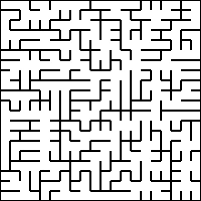
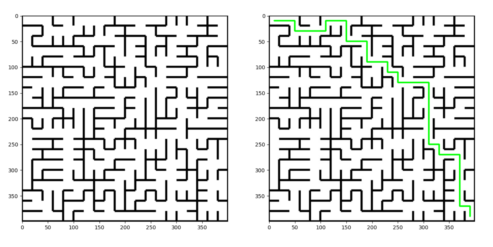

<h1 style = "color:orange; font-size:3.5em; font-family:san-serif; text-align: center"> Maze Solver</h1>

### About

This is a Python Image Processing Project. It uses OpenCV and NumPy to solve a maze from its image.

For all the images, the start coordinate is taken as the upper right corner cell, and the end coordinate is taken as the lower left corner cell.

### Input

This code has been tested to work on 5 images stored in the images/ folder. A sample image is shown below.

### Output

The result after applying the algorithm is shown below. More output images can be found in the output/ folder.

### Algorithm

I have tried using a new approach for solving this problem. Instead of travelling through the maze and applying DFS or such algorithms, the algorithm iteratively eliminates those cells that will never be traversed.

Such cells are called dead-ends because they can only be entered from one side, so the traveller should never bother going there.

The steps in the algorithm are :

1. Read the grayscale image and binarize it. Here, a constant threshold is used.
2. Convert the image into a suitable form that only gives the necessary information. Refer MazeRepr for explanation of this step.
3. Eliminate all the dead-ends from the maze. Refer MazeSimplify for this.
4. With all the unnecessary cells removed, everything that remains is now our path. In case multiple paths exists, all will be available for the traveller to choose from. Refer PathFinder for this.
5. Display the calculated path.

### Directory Structure

- **images** - contains the maze images used for testing.
- **MazeUtils** - contains modules used for solving the maze.
    - *MazeRepr.py* - Converts the binary image to a matrix describing the maze.
    - *MazeSimplify.py* - Eliminates dead ends from the maze.
    - *PathFinder.py* - Converts the matrix with eliminated. cells to a list containing the coorinates of final path.
    - *MazeDisplay.py* - Module that displays the original and solved mazes.
- *main.py* - Main script to call when running the code.
